## Step 5: Setup the frontend React framework, update the components, and start OctoFit Tracker app

> [!NOTE]
> **Behind the scenes:** This exercise uses custom instruction files that help guide GitHub Copilot's responses. The instruction file `.github/instructions/octofit_tracker_react_frontend.instructions.md` contains React framework setup commands, Bootstrap integration, and frontend structure guidelines that Copilot references when generating code for this step.

```mermaid
%%{init: {'theme': 'neutral', 'themeVariables': { 'primaryColor': '#4a90d9', 'primaryTextColor': '#fff', 'primaryBorderColor': '#2d5a87', 'lineColor': '#5c6bc0', 'secondaryColor': '#81c784', 'tertiaryColor': '#fff3e0'}, 'flowchart': {'nodeSpacing': 50, 'rankSpacing': 80, 'padding': 40}}}%%
flowchart LR
    User((👤 User))
    
    subgraph Codespaces [☁️ GitHub Codespaces]
        subgraph App [🏋️ OctoFit Tracker App]
            Frontend[⚛️ React<br/>Frontend]
            Backend[🐍 Django<br/>Backend]
            Database[(🍃 MongoDB<br/>Database)]
        end
    end
    
    User --> Frontend
    Frontend <--> Backend
    Backend <--> Database
    
    style User stroke-width:4px,fill:#e3f2fd,color:#000,stroke:#1976d2
    style Frontend stroke-width:4px,fill:#b3e5fc,color:#000,stroke:#0288d1
    style Backend stroke-width:2px,fill:#c8e6c940,color:#00000050,stroke:#2e7d3250,stroke-dasharray: 5 5
    style Database stroke-width:2px,fill:#ffe0b240,color:#00000050,stroke:#ef6c0050,stroke-dasharray: 5 5
    style Codespaces stroke-width:3px
    style App stroke-width:3px,stroke:#ff6b35
    
    linkStyle 0 stroke-width:3px
    linkStyle 1 stroke-width:2px,stroke:#cccccc
    linkStyle 2 stroke-width:2px,stroke:#cccccc
```



> **🎯 Current Focus:** In this step, we're setting up the **React Frontend** and connecting it to the user experience.

In this step, we will accomplish the following:

- Setup the octofit-tracker frontend React framework.
- Update the following components to include the React framework:
  - src/App.js
  - src/index.js
  - src/components/Activities.js
  - src/components/Leaderboard.js
  - src/components/Teams.js
  - src/components/Users.js
  - src/components/Workouts.js
- Start the React app and check the output.

Copy and paste the following prompt(s) in the GitHub Copilot Chat and select the "Agent" instead of "Ask" or "Edit" from the drop down where you are inserting the prompt.

> [!NOTE]
>
> - Keep in mind that the Copilot agent mode is conversational so it may ask you questions and you can ask it questions too.
> - Wait a moment for the Copilot to respond and press the continue button to execute commands presented by Copilot agent mode.
> - Keep files created and updated by Copilot agent mode until it is finished.
> - Agent mode has the ability to evaluate your code base and execute commands and add/refactor/delete parts of your code base and automatically self heal if it or you makes a mistake in the process.

**Open up a new Copilot Chat session by hitting the plus `+` icon in the Copilot Chat pane.**

### :keyboard: Activity: Install the octofit-tracker frontend React framework

> 
>
> ```prompt
> Let's setup the octofit-tracker frontend React  framework and
> ensure everything is created in the `octofit-tracker/frontend` directory by using `--prefix`
>
> 1. Make sure the the octofit-tracker/frontend directory exists.
> 2. create the react app
> 3. Install react, bootstrap, and react-router-dom
> 4. Import bootstrap css in the src/index.js file.
> 5. Don't change .gitignore file
>```

> [!WARNING]
> ⏰ This step will take approximately 1-2 minutes to complete.

### :keyboard: Activity: Update the octofit-tracker frontend React components

> 
>
> ```prompt
> Let's update the octofit-tracker frontend React components.
>
> - Update the following components to include the React framework to point to the backend REST API:
>   - src/App.js
>   - src/index.js
>   - src/components/Activities.js
>   - src/components/Leaderboard.js
>   - src/components/Teams.js
>   - src/components/Users.js
>   - src/components/Workouts.js
> - In each component replace the fetch url with the codespace url
>   https://$REACT_APP_CODESPACE_NAME-8000.app.github.dev/api/[component]/
>   for the Django rest framework backend.
>   make sure all components are pulling data from the REST api endpoint
>   for display in the REACT frontend
> - Make sure to use the correct port and protocol http or https.
> - Update src/App.js to include the main navigation for all components.
> - Make sure react-router-dom is used for the navigation menu.
> - The react app should show the navigation menu and the components.
> - Update all components to log the fetched data and make them compatible with both paginated (.results) and plain array responses.
> - Add console.log statements to each component to log the fetched data and the REST API endpoints.
> ```

### :keyboard: Activity: Start the react app and check the output

Now, let's actually try running the react application! In the left sidebar, select the `Run and Debug` tab and then press the **Start Debugging** icon.


Go to the running React Frontend url that pops up for port 3000 that looks like the following:


Once you open it in your web browser you will get a warning like the following:


Once you click `Continue` it should look similar the following:


<details>
<summary> No data displayed? Ensure the backend is running</summary><br/>

The React app fetches data from the Django backend REST API on port 8000. If no data is displayed, the backend may not be running.

1. **Check if the backend is already running:**
   - Look at the **Ports** tab in VS Code - port 8000 should be listed and forwarded
   - Or check your terminals for a running Django server

2. **If the backend is NOT running, start it:**
   - Open the **Run and Debug** panel (`Ctrl+Shift+D` or `Cmd+Shift+D`)
   - Select **"Launch Django Backend"** from the dropdown
   - Click the green **Start Debugging** button (▶️)
   - Wait until you see: `Starting development server at http://0.0.0.0:8000/`

3. **Verify the backend is accessible:**
   - Port 8000 should appear in the **Ports** tab
   - You can test by visiting the API URL in your browser

> [!IMPORTANT]
> Keep the Django backend running in a separate debug session while you work with the React frontend.

</details>

### :sparkles: Activity: Let's add some formatting, structuring, and styling to the octofit tracker app

> 
>
> ```prompt
> Let's style this like App.css and make it look nice.
>
> - Let's make the App.js and all components javascript files in the app are consistent with the following:
>   - Use bootstrap tables for the data in all javascript components.
>   - Use bootstrap buttons for the buttons.
>   - Use bootstrap headings for the headings.
>   - Use bootstrap links for the links.
>   - Use bootstrap navigation for the navigation menu.
>   - Use bootstrap forms for the forms.
>   - Use bootstrap cards for the cards.
>   - Use bootstrap modals for the modals.
>   - Consistent table layouts for all components data.
>```

### :sparkles: Optional Activity: Let's make the octofit tracker app look nice, pretty, and add some color

> 
>
> ```prompt
> Let's style this like App.css and make it look nice.
> 
> -  Edit the App.css file to do the following:
>   - Add some color to the background.
>   - Add some color to the text.
>   - Add some color to the tables.
>   - Add some color to the buttons.
>   - Add some color to the headings.
>   - Add some color to the links.
>   - Add some color to the navigation menu.
> - Add the octofitapp-small logo justified to the left to the app and make it look nice.
> - Add a favicon to the app and make it look nice.
>```

### :bug: Optional Activity: Let's fix some issues present in the React frontend app

The page might not look exactly as expected. Let's use Copilot agent mode to help us fix any issues present in the React frontend app. Copy/paste the following prompt in the GitHub Copilot Chat and select the "Agent" instead of "Ask" or "Edit" from the drop down where you are inserting the prompt.

#### :bug: The users table is missing name and the username

> 
>
> ```prompt
> The users page is missing the name and the username for each user
> ```

#### :bug: The activities page has an invalid date

> 
>
> ```prompt
> In the activities page, the date is invalid
> ```

#### :bug: The teams page is not displaying the correct number of members

> 
>
> ```prompt
> The teams page is not displaying the correct number of members. All teams show 0 members
> ```

#### :bug: The leaderboard page is not displaying the Team correctly and total calories is 0

> 
>
> ```prompt
> The leaderboard page has the following issues for each user:
> - is not displaying the Team correctly (currently showing N/A)
> - total calories is 0
> ```

#### :bug: The workouts page is not displaying some fields (with screenshot)

We can even provide a screenshot to help Copilot agent mode understand the issue better. First, take a screenshot of the workouts page showing the missing fields and paste it in the chat but don't press ENTER just yet. Then, copy/paste the following prompt in the same chat and submit both the screenshot and the prompt together.

> 
>
> ```prompt
> The workouts page is not displaying some fields. Here's an example of Thor
> ```

#### :bug: The home page cards are not navigating to the correct pages

> 
>
> ```prompt
> On the home page, when I click the cards Users, Activities or Leaderboard I want to navigate to the correspondent pages.
> ```

### :sparkles: Optional Activity: Let's add a new feature to edit user details using the Plan mode

In this optional activity, let's use Copilot Plan mode to help us add a new feature to edit user details. Copy/paste the following prompt in the GitHub Copilot Chat and select the "Plan" instead of "Ask", "Edit" or "Agent" from the drop down where you are inserting the prompt.

> 
>
> ```prompt
> I want to be able to edit each user personal details including the team the user belongs to.
> ```

After Copilot Plan mode provides a plan, you can agree or change the plan. Once you agree on the plan, just hit "Start Implementation" and Copilot will start generating the code for you.

### You did it! 💪

> [!TIP]
>
> - Try creating your own prompts to change the application appearance, add features, and try different models.

1. Now that we have created the React frontend for all application components, let's check our changes in to our `build-octofit-app` branch.

1. With our new changes complete, please **commit** and **push** the changes to the `build-octofit-app` branch.

1. Wait a moment for Mona to check your work, provide feedback, and share the next lesson so we can keep working!

<details>
<summary>Having trouble? 🤷</summary><br/>

If you don't get feedback, here are some things to check:

- Make sure your commit changes were made for the following files to the branch `build-octofit-app` and pushed/synchronized to GitHub:
  - `octofit-tracker/frontend/src/components/Activities.js` and it contains `-8000.app.github.dev/api/activities/`
  - `octofit-tracker/frontend/src/components/Leaderboard.js` and it contains `-8000.app.github.dev/api/leaderboard/`
  - `octofit-tracker/frontend/src/components/Teams.js` and it contains `-8000.app.github.dev/api/teams/`
  - `octofit-tracker/frontend/src/components/Users.js` and it contains `-8000.app.github.dev/api/users/`
  - `octofit-tracker/frontend/src/components/Workouts.js` and it contains `-8000.app.github.dev/api/workouts/`
- If Mona found a mistake, simply make a correction and push your changes again. Mona will check your work as many times as needed.

</details>
